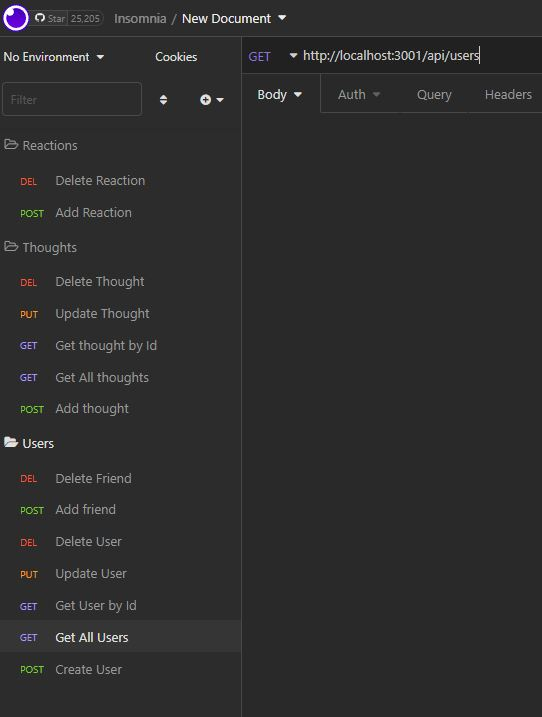
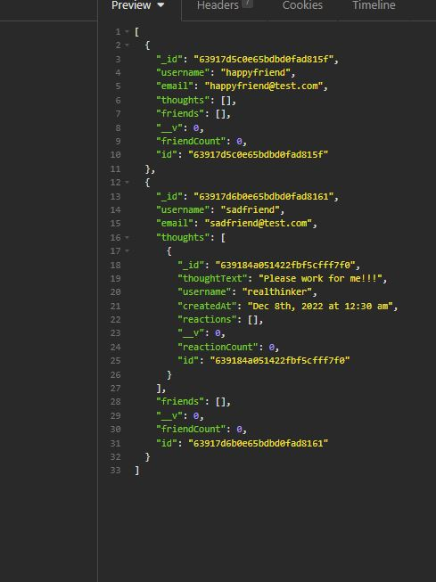

# NoSQL-Social-Network-API

## Description

- An API for a social network web application where users can share their thoughts, react to friends’ thoughts, and create a friend list.

## Description
- When you enter in node index.js the server starts and the mongoose models are synced to the MongoDB database.
- When you follow all GET routes in insomnia for Users and Thoughts then it displays data in JSON format.
- When you follow all POST, PUT, and DELETE routes in insomnia then you can create, update, and delete users and thoughts.
- You also can add and delete reactions to thoughts and display them.

## Table of Contents

- [Usage](#usage)
- [Credits](#credits)
- [License](#license)

## Usage

Instructions:
- download through this github.
- npm install mongoose and express.
- Open up terminal.
- Make sure you are in folder with index.js.
- type node index.js to start server.
- test routes in insomnia.

Link to Video: https://drive.google.com/file/d/1fK82uHlhofbjVrcRdX1V9CISLjIVaj2N/view?usp=share_link

## Credits

Mongoose
Express

## License

MIT License

Copyright (c) [2022] [Isaac Falcon]

Permission is hereby granted, free of charge, to any person obtaining a copy
of this software and associated documentation files (the "Software"), to deal
in the Software without restriction, including without limitation the rights
to use, copy, modify, merge, publish, distribute, sublicense, and/or sell
copies of the Software, and to permit persons to whom the Software is
furnished to do so, subject to the following conditions:

The above copyright notice and this permission notice shall be included in all
copies or substantial portions of the Software.

THE SOFTWARE IS PROVIDED "AS IS", WITHOUT WARRANTY OF ANY KIND, EXPRESS OR
IMPLIED, INCLUDING BUT NOT LIMITED TO THE WARRANTIES OF MERCHANTABILITY,
FITNESS FOR A PARTICULAR PURPOSE AND NONINFRINGEMENT. IN NO EVENT SHALL THE
AUTHORS OR COPYRIGHT HOLDERS BE LIABLE FOR ANY CLAIM, DAMAGES OR OTHER
LIABILITY, WHETHER IN AN ACTION OF CONTRACT, TORT OR OTHERWISE, ARISING FROM,
OUT OF OR IN CONNECTION WITH THE SOFTWARE OR THE USE OR OTHER DEALINGS IN THE
SOFTWARE.

---

## Badges

